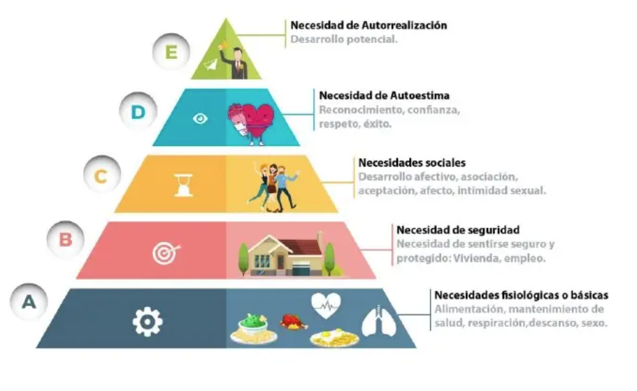

# Juntas Efectivas

* ## Introduccion
 
  ### La importancia del tiempo
    Tanto valoramos este recurso que tenemos rutinas para maximizarlo y cumplir objetivos cotidianos o profesionales.

        ¿Por que es necesario reunirnos?

    El ser humano es considerado sociable por naturaleza debido a diversar razones que se encuentran tanto en su biologia como en su desarrollo cultural y psicologico

    

    La teoria de la motivacion humana, propuesta por Abraham Masiow, sugiere que la necesidad fundamental.

    Nos reunimos para:
    - Toma de decisiones
    - Resolucion de problemas
    - Planificacion y estrategia
    - Comunicación e intercambio de información
    - Construcción de equipo y fortalecimiento de relaciones
    - Coordinación de esfuerzos
    - Retroalimentación y evaluación
    - Motivación y compromiso
    - Prevención de problemas
    - Aprendizaje y desarrollo

    ### Tipos de reuniones
    - Virtual
    - Hibrida
    - Presencial

    ### ¿Es necesario realizar una junta?
        Juntas vs e-mail, slack, boletín, etc.

    ### Antes
    - Establece un objetivo
    - Seleciona a los participantes
    - De a conocer la agenda
    - Determinar la duración

    - Identifica tu audencia
    - Preparate
    - Espera Interrupciones.

    ### Algunos tops para evitar declinacion
    
    * Comparte la convocatoria con anticipación.
    * Realiza un sondeo prvio sobre disponibilidad de los participantes clave.
    * OBjetivo y agenda claros y concretos.
    * Si necesitas el respaldo de tu jefe inmediato para convocatoria no dudes en solicitarlo

    #### ¿Considera importante habilitar la camara durante una reunion virtual?

* ## ¿Tienes una reunion?- Preparate
* ## Tips para una junta efectiva

    ### Durante
    - Puntualidad
    - Minuta y el uso de la tecnología ( no olvides las politicas de seguridad de la información)
    - Genera un canal sano de comunicacion
    - Has buenas preguntas, practica la escucha activa
    - Rodeate de los especialistas (networking)
    - Conecta con la audiencia (Storytelling)
    - Usa medios visuales, respalda el mensaje con datos
    - No olvides a los participantes remotos

    - Controversia
    - Genera acuerdos

    ### Despues

    Comparte la minuta con los acuerdos y da seguimiento por canalesorganizacionales.

    ### Ejemplos de difentes estilos para las reuniones
    - Reuniones con marco de trabajo Agile (Scrum) - Timeboxing
    - Telmex - Shadowing
    - Amazon - Confidencialidad de la información

    #### ¿Recuerda como te sentiste en la ultima junta del dia de hoy? ¿ Que harias diferentes?

    ### Actividad
    Ve a tu calendario y selecciona 3 reuniones, deja una nota con lo que podrias mejorar.

    ### Soy invitado a una reunion
    1. Pregunta a tu lider el proposito y expectativas (output) de asistir a la reunion
    2. Clarifica la autonimia para la toma de decisiones.
    3. So no eres experto en el tema invita a los especialistas para agilizar la toma de decisiones.
    4. Participa activamente, has preguntas.
    5. Comparte minuta con los interesados del equipo.

* ## Y al finalizar ¿Que sigue?

* ## Recursos
    - #### Tips para facilitadores:
        __[linkedin.com/company/aj&smart/](https://www.linkedin.com/company/aj&smart/)__
    - #### Story telling:
        __Long story short - Margot Leitman__
    - ####  Time boxing:
        __[youtu.be/6pTjSgWYcDA?si=mgg9_yDnslf-oYgj](https://youtu.be/6pTjSgWYcDA?si=mgg9_yDnslf-oYgj)__
    
